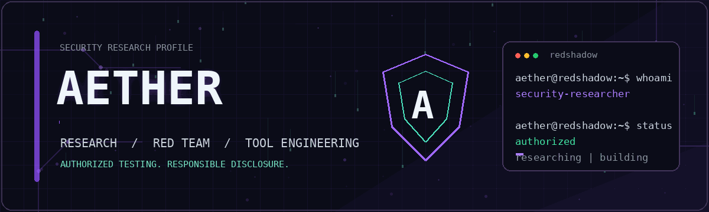
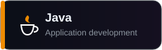
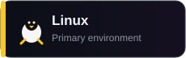
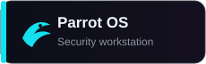
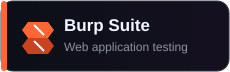

<div align="center">



<br>

# San Wana Zaw

### Cybersecurity Student · Security Researcher · Tool Builder

`Web Security` · `Red Teaming` · `Vulnerability Research` · `Recon Automation`

<br>

[Profile](https://github.com/Aether-0) ·
[Repositories](https://github.com/Aether-0?tab=repositories) ·
[Projects](https://github.com/Aether-0?tab=projects)

</div>

---

## Profile

```text
Alias       : Aether
Discipline  : Cyber Security
Role        : Security Researcher and Tool Builder
Environment : Linux
Objective   : Professional Penetration Tester and Red Teamer
```

I am a B.Sc. Computer Science student specializing in Cyber Security. My work focuses on practical security research, penetration testing, reconnaissance automation, and building tools that make authorized testing more efficient.

I value deep technical understanding, reproducible results, clear reporting, and responsible disclosure.

---

## Focus

<table>
<tr>
<td width="50%" valign="top">

### Security Research

- Web application security
- Vulnerability analysis
- Proof-of-concept development
- Authentication and authorization testing
- Responsible vulnerability disclosure
- Technical security reporting

</td>
<td width="50%" valign="top">

### Offensive Security

- Penetration testing
- Red-team methodology
- Attack-surface analysis
- Reconnaissance
- Network security
- Capture the Flag challenges

</td>
</tr>
<tr>
<td width="50%" valign="top">

### Engineering

- Security automation
- Command-line tools
- HTTP testing utilities
- Linux tooling
- Workflow integration
- Technical documentation

</td>
<td width="50%" valign="top">

### Current Development

- Advanced web exploitation
- Business-logic testing
- Access-control vulnerabilities
- Network exploitation
- Secure tool development
- Professional reporting

</td>
</tr>
</table>

---

## Featured Work

<table>
<tr>
<td width="50%" valign="top">

### [HTTPC](https://github.com/Aether-0/httpc)

A lightweight HTTP method-testing utility written in Go for authorized security assessments.

**Capabilities**

- Concurrent request processing
- Custom HTTP method selection
- Status-code filtering
- Configurable timeouts and retries
- Standard-input and file support
- Silent and verbose output

`Go` `HTTP` `Concurrency` `CLI`

</td>
<td width="50%" valign="top">

### [CVE-2024-12986 Research Tooling](https://github.com/Aether-0/CVE-2024-12986)

Educational tooling for studying CVE-2024-12986 in controlled laboratory environments.

**Contents**

- Bash-based scanner
- Python proof of concept
- Vulnerability documentation
- Testing guidance
- Responsible-use notice

`Python` `Bash` `HTTP` `Security Research`

</td>
</tr>
<tr>
<td width="50%" valign="top">

### [TryHackMe VPN Shortcut](https://github.com/Aether-0/tryhackmevpn-shortcut)

A Linux utility that simplifies managing a TryHackMe OpenVPN connection.

**Capabilities**

- VPN configuration installation
- Global command shortcut
- Start and stop controls
- Configuration replacement
- Linux-focused workflow

`Bash` `Linux` `OpenVPN` `Automation`

</td>
<td width="50%" valign="top">

### Vulnerability Research

My research process emphasizes reproducibility, minimal proof of impact, clear documentation, and coordinated disclosure.

**Research milestone**

`CVE-2025-55575`

**Principles**

- Confirm scope before testing
- Prove impact without causing harm
- Access only what is necessary
- Provide practical remediation

</td>
</tr>
</table>

---

## Technical Stack

### Programming and Scripting

<p>
  
  
  
  
</p>

### Systems and Development

<p>
  
  
  
  
</p>

### Security Tools

<p>
  
  
  
  
</p>

---

## Current Direction

```python
aether = {
    "research": [
        "web application vulnerabilities",
        "authentication weaknesses",
        "access-control failures",
        "network security"
    ],
    "engineering": [
        "recon automation",
        "security tooling",
        "Linux utilities",
        "repeatable testing workflows"
    ],
    "principles": [
        "understand before automating",
        "test only with authorization",
        "prove impact without causing harm",
        "document findings clearly"
    ],
    "goal": "Become a professional penetration tester and red teamer"
}
```

---

## Research Workflow

```text
SCOPE
  Confirm authorization
  Review program rules
  Identify allowed assets
  Define testing limits

RECON
  Discover assets
  Identify technologies
  Map exposed services
  Build the attack surface

TEST
  Authentication
  Authorization
  Input handling
  Business logic
  Session management
  Security configuration

VALIDATE
  Reproduce consistently
  Identify the root cause
  Confirm realistic impact
  Minimize unnecessary access

REPORT
  Provide clear reproduction steps
  Explain the security impact
  Include relevant evidence
  Recommend practical remediation
```

---

## Responsible Security

All security testing, vulnerability research, and proof-of-concept work presented on this profile is intended only for systems I own, controlled laboratories, Capture the Flag challenges, educational security platforms, bug-bounty programs within their published scope, or systems where explicit authorization has been granted.

I do not support unauthorized access, credential abuse, data theft, service disruption, malware deployment, destructive testing, or activity outside an approved scope.

---

## Collaboration

For project questions, bug reports, improvements, or responsible security collaboration, open an issue in the relevant repository.

<div align="center">

### Think deeply. Test responsibly. Build continuously.

```text
aether@redshadow:~/security$ status
learning | researching | building
```

</div>
